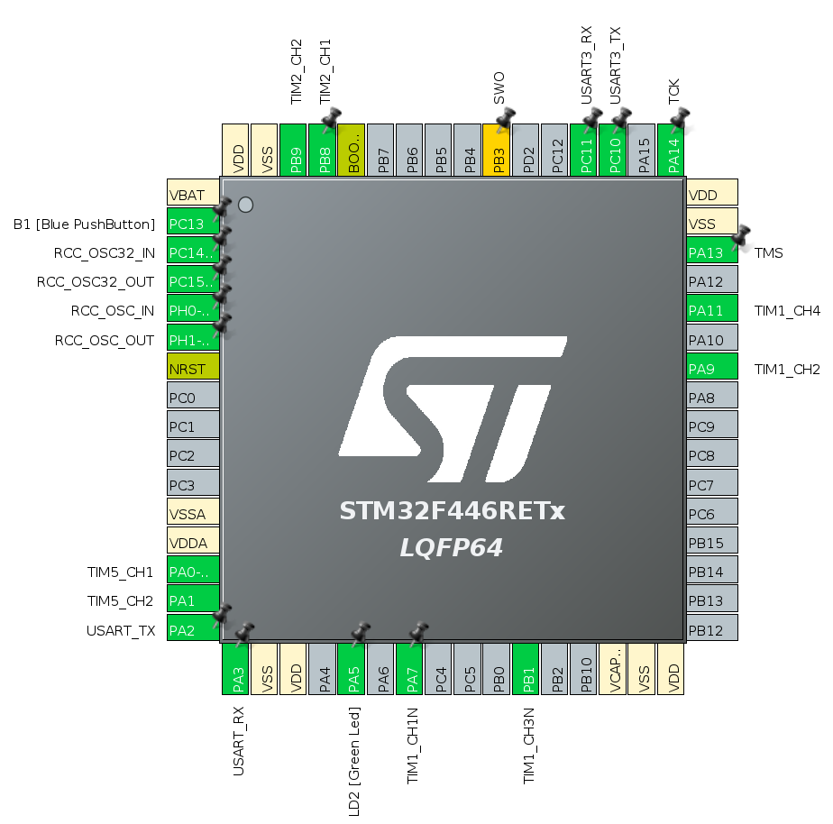

# STM32F446RE

## tim1 and tim8 
* Complementary pwm (up to 3 phases) with dead zone
* Drive by APB2 clck (84MHz default on nucleo)
* prescaler set to 84 => timer frequency = 1 MHz
* prescaler set to 1000 (STEPS) => PWM period = 1 ms
* default pulse set to 500 (STEPS/2) => duty cycle = 50 %

## serial protocol:
uart1 (RX-PA10 + TX-PB6) + uart2 (USB) are activated

The both uart are IRQ managed in parallel, they work exactly the same way.

### UART Commands
* `?` : get duty cycles. answer `=xxxx,yyyy\r\n`
* `#xxxx+yyyy` : set left duty cycle to xxxx and right to yyyy (xxxx and yyyy truncated at 1000)
	answer `!xxxx,yyyy\r\n`

**Blue Button**: change duty-cyles by 10% (cycling up and down) + toggle LD2
**Black Button**: reset set CPU and set duty cycles to 50% + uart answer: `!0500,0500\r\n`

## Output:
 Name | pin 
 --- | :---:
 UART1 RX| PA10
 UART1 TX| PB6
 Tim1 chan1| PA8
 Tim1 chan1N| PB13
 Tim1 chan2| PA9
 Tim1 chan2N| PB14
 Tim8 chan1| PC6
 Tim8 chan1N| PA7
 Tim8 chan2| PC7
 Tim8 chan2N| PB0

------

## TODO
* add enable signal to stop motors
* manage rotary encoder and return speed?

